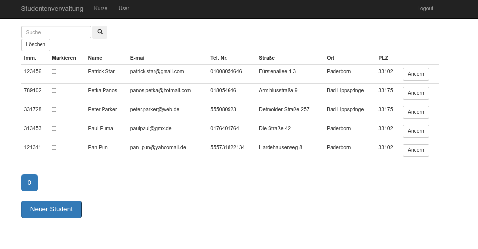

# Student Resource Planning

[](https://github.com/DavidLangen/Student_Resource_Planning/actions/workflows/maven-publish.yml)

## Über das Projekt

Ziel des Projektes war es eine Studen-Plannungs-Webanwendung für eine fiktive Universität zu entwickeln.
Dabei sollte die Möglichkeit geschaffen werden, sowohl für fiktive Dozenten Kurse/Student zu verwalten 
als auch die Berechtigung der Dozent/Nutzer zu verwalten (Siehe UseCase-Diagramm).  


## Verwendete Technologien

- Java
- [Spring-boot](https://spring.io/projects/spring-boot) mit einer H2 Datenbank
- [JQuery](https://jquery.com/)
- [Thymeleaf](https://www.thymeleaf.org/)

## Lokales Setup / Development

### Starten
Die Anwendung kann lokal über folgendes Kommando gestartet werden:

```
mvn spring-boot:run  
```
### Testdaten
Testdaten für ein lokales testen können über das SQL-Skript [data.sql](src/main/resources/data/data.sql) abgeändert werden

## Screenshots




